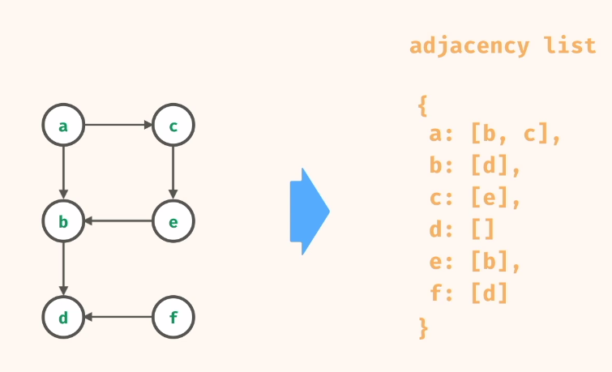
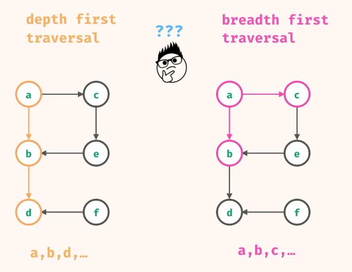
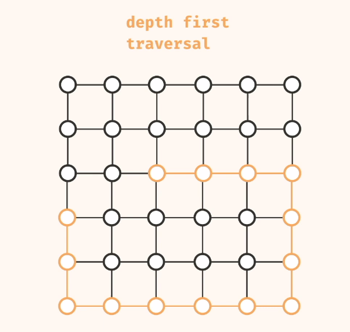
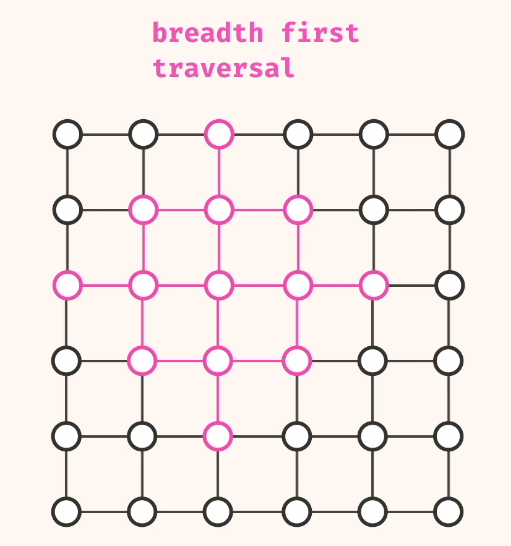
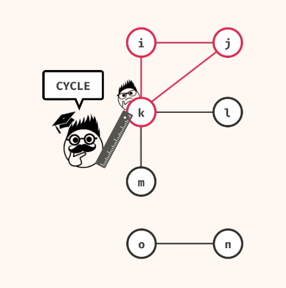
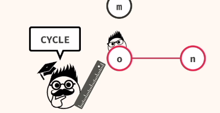
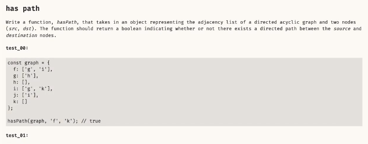

# Graphs

>- Depth First Traversal uses Stack.
>- Breadth First Traversal uses Queue

Graph = node + edge.
A graph is a collection of node and edges.
Edges is the connection between pair of nodes.

Directed graphs have arrow edges.

Neighbour node is any node that is accessible through an edge.

## Depth First Traversal

#### Depth-First search: search deep before shallow.

Breadth First Traversal

* Watch out for cycles.
* We mark visited node as visited to avoid infinte loops.

##  QUESTIONS

