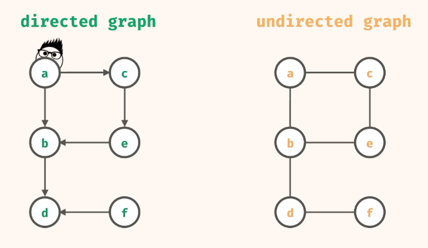

# Graphs

## Depth-First search: search deep before shallow.

Graph = node + edge.
A graph is a collection of node and edges.
Edges is the connection between pair of nodes.

Directed graphs have arrow edges.

Neighbour node is any node that is accessible through an edge.

