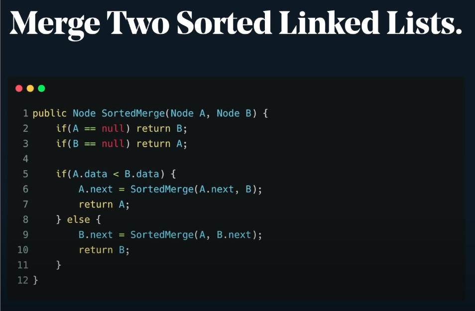

# Recursion

Recursion is a function that calls itself.

### Pros
* Bridges the gap between elegance and complexity.
* Reduce the need for complex loops and auxiliary data structures.
* Can reduce time complexity easily with memorization.
* Works really well with recursive structures like trees and graphs.

### Cons
* Slowness due to CPU overhead
* Can lead to out of memory error or stack overflow exceptions.
* Can be unnecessarily complex if poorly constructed.

## Divide & Conquer

Divide and conquer algorithms are mostly recursive algorithms.

## Optimization in Recursion

* Memoization & Caching.
Memoization is optimization techniques that makes application more efficient and faster.

* Tail-Call Recursion Optimization

Make the recursive call be the last instruction.

Tail call recursion optimization is supported by functional languages. Not supported by Python, Java. Supported for JS in Safari.